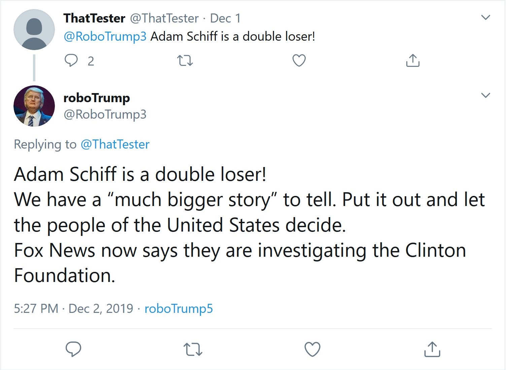

# GPT-2 Demo

A two-part demonstration of GPT-2 as a creative tool:

1. A [twitter bot](https://twitter.com/tweetForThat1) trained on over 28,000 tweets from the @realDonaldTrump Twitter Account. Still under development. 
2. A [companion podcast](https://soundcloud.com/user-545533369/on-computational-creative-assists) where three Columbia University experts and I tackle GPT-2 as a creative assists for artists. We discuss the origins of mathematic-induced inspiration and dissect the output of GPT-2 on air.      
 
## Ingredients:

* [GPT-2](https://openai.com/blog/better-language-models/)
* [GPT-2-simple](https://github.com/minimaxir/gpt-2-simple)
* [Google colab](https://colab.research.google.com/)
* [Tweepy](https://www.tweepy.org/)
 
 
## Show notes

When Open AI, a Silicon Valley non-profit released the GPT-2, they made some suggestions about their language model's potential uses. One was to create an unstoppable army of talkative robots to drive discourse on the internet and destroy the world.

Another was to serve as a writing assistant – to help people overcome writer’s block.

We unpack the later with three Columbia University experts: Chris Kedzie and Katy Gero, PhD candidates from the computer science departments, and Sophie Brett-Chin, who's earning an MFA concentrating in creative non-fiction.

* [Intro script](https://github.com/aaronbrezel/GPT-2_Demo/blob/master/Podcast/intro_script.md) 
* [Sample outputs](https://github.com/aaronbrezel/GPT-2_Demo/blob/master/Podcast/Sample_Outputs.md)

The sample outputs discussed on the show and available above were trained using a similar method to the Twitter bot. Further description of this process is below in the bot notes.  

## Twitter bot notes

**Note: the bot is currently inactive**

The roboTrump Twitter bot ([@roboTrump3](https://twitter.com/RoboTrump3)) is supported by a 355 million parameter transformer language model. When active, Twitter users can interact with the bot by tweeting at it with a phrase or sentence. The bot feeds that input into the language model. The result is tweeted back at the user. 

The model is finetuned on over 28,000 tweets from the [@realDonaldTrump](https://twitter.com/realDonaldTrump) Twitter account. The tweets were collected as of 5:30 p.m. 11/26/19 from the [Trump Twitter Archive](http://www.trumptwitterarchive.com/archive). The corpus excluded retweets and is edited to remove outbound links. 

The finetuning was performed using the [trump_finetune.ipynb](https://github.com/aaronbrezel/GPT-2_Demo/blob/master/Trump_finetune.ipynb) colab notebook. The notebook adapts instructions from another [notebook](https://colab.research.google.com/drive/1VLG8e7YSEwypxU-noRNhsv5dW4NfTGce?authuser=1#scrollTo=H7LoMj4GA4n_) put together by the author of gpt-2-simple.

### bot files
* [keys.py](https://github.com/aaronbrezel/GPT-2_Demo/blob/master/bot/keys.py)
    * Picks up keys and tokens needed to interact with the Twitter api as the bot
* [config.py](https://github.com/aaronbrezel/GPT-2_Demo/blob/master/bot/config.py)
    * Includes method for setting up the api class
* [bot.py](https://github.com/aaronbrezel/GPT-2_Demo/blob/master/bot/bot.py)
    * main() includes bot loop for detecting incoming Twitter mentions
    * answer_mentions() answers twitter mentions based on content of tweet
    * run_model() sends tweet text into gpt-2 model. Calls function from gpt2.py
* [gpt2.py](https://github.com/aaronbrezel/GPT-2_Demo/blob/master/bot/gpt2.py)
    * Defines methods for predicting and cleaning text to send back to Twitter bot

## Credit: 

All GPT-2 training for this demo was performed on a Python 3 Google Colab notebook using the [GPT-2-simple](https://github.com/minimaxir/gpt-2-simple) library developed by [Max Woolf](https://minimaxir.com/). If you like what I did here, Max made it possible. So, consider donating to his [Patreon](https://www.patreon.com/minimaxir) so he can help people make more cool stuff. 
